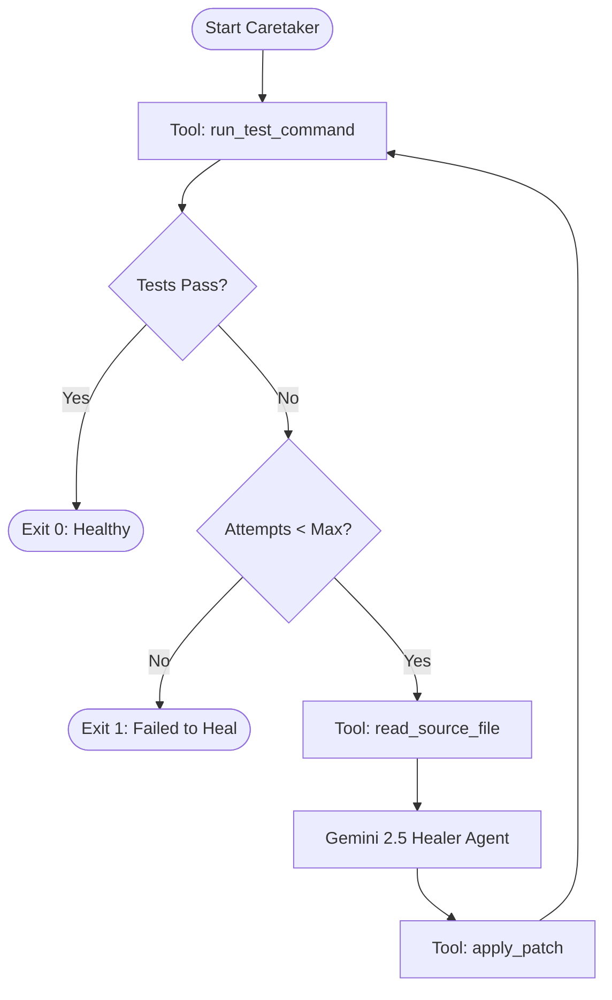

# Caretaker AI 🤖🔧

Autonomous self-healing agent for unmaintained, legacy, and EOL software pipelines.

Caretaker AI acts as a digital custodian for unmaintained software. It automatically intercepts test/build failures, analyzes the failure stack trace, queries a Gemini-powered Agent to generate targeted code patches, applies the corrections, and verifies that the pipeline is restored to a healthy state.

---

## 🌟 Key Features

- **Autonomous Healing Loop:** Detects, diagnoses, patches, and verifies code failures in an iterative loop.
- **ADK 2.0 Architecture:** Built on the Google Agent Development Kit (ADK) using native agent tool-use capabilities.
- **Robust Tooling:** Equips the agent with filesystem read/write permissions and shell command execution.
- **Command Line & Agent Playground Support:** Run it as a standard developer CLI tool or load it into the Google Agent Playground for interactive visual debugging.

---

## 🏗️ Architecture & Self-Healing Loop



---

## 🛠️ Agent Specifications (ADK 2.0)

Caretaker AI is defined as an ADK `Agent` equipped with three custom tools:

1. **`read_source_file`**: Reads the target source file that contains the bug.
2. **`run_test_command`**: Executes the test suite or build command (e.g., `pytest`, `npm test`) and returns output/logs.
3. **`apply_patch`**: Overwrites the target file with the corrected code.

### System Instructions
The agent is instructed to:
- Read the code and run the failing test.
- Analyze the traceback and diagnose the root cause (NameError, TypeError, SyntaxError, etc.).
- Formulate a precise correction.
- Write the complete file back and rerun tests to verify success.
- Halt immediately when the test suite passes, or abort if the retry limit is exceeded.

---

## 🚀 Getting Started

### 1. Installation

Install Caretaker AI in editable mode:

```bash
uv pip install -e .
```

### 2. Authentication

Authentication is managed via Google Cloud Application Default Credentials (ADC) or a custom Google Cloud Project. Ensure you are logged in:

```bash
gcloud auth application-default login
```

---

## 💻 Usage

### Command Line Interface (CLI)

Run Caretaker AI on a failing target file:

```bash
caretaker --test-command "pytest legacy_app/test_calculator.py" --target-file "legacy_app/calculator.py" --max-retries 3
```

### Agent Playground & Google Agents CLI

Since Caretaker AI is structured as an ADK Agent, it can be loaded directly into the Google Agent Playground or executed using `google-agents-cli`:

```bash
uvx google-agents-cli run "Repair legacy_app/calculator.py using pytest legacy_app/test_calculator.py"
```

---

## 📂 Project Structure

```
caretaker-ai/
├── caretaker_ai/
│   ├── __init__.py    # Exports the ADK App
│   ├── agent.py       # Core ADK Agent & Tool definitions
│   ├── cli.py         # CLI wrapper around ADK runner
│   ├── engine.py      # Legacy engine (for reference)
│   ├── patcher.py     # Unified diff & file patching utilities
│   └── runner.py      # CLI execution helper
├── legacy_app/
│   ├── calculator.py  # A buggy application file
│   └── test_calculator.py
└── pyproject.toml     # Project configuration & dependencies

---

## 🔮 Future Vision: Continuous DevOps & GitHub Monitoring Agent

Caretaker AI is designed to scale from a local CLI into a fully autonomous, continuous DevOps Agent. By monitoring GitHub repositories for issues and bug reports, Caretaker can autonomously:

1. **Detect:** Listen to repository webhooks or poll the GitHub API for new issues labeled as bugs.
2. **Reproduce:** Read the issue description and use Gemini to generate a dedicated pytest file (e.g. `test_bug.py`) that replicates the bug.
3. **Heal:** Execute the self-healing loop locally until the generated reproduction test passes.
4. **Verify & Deploy:** Commit the code modifications, push them to a temporary branch, and submit a Pull Request back to the main repository.

The conceptual layout for this extension is outlined in [devops_agent.py](file:///c:/Users/danny/OneDrive/Desktop/my-first-project/caretaker-ai/caretaker_ai/devops_agent.py).
```
